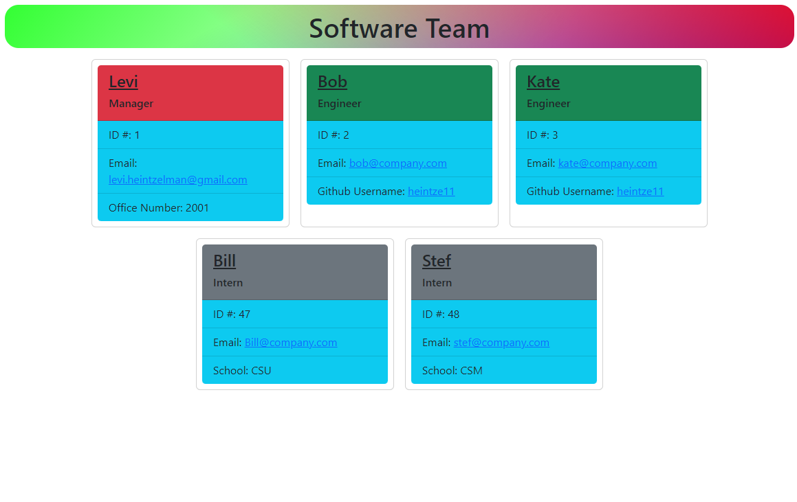

# Software Team Generator

## Description
This app outputs a styled HTML page listing all memebers of the software team based on input from the Terminal. It uses classes to create cards for each type of employee.

## Installation
Requires Inquirer, FS, and Jest.

## Usage
Run through the terminal using "node index.js".

## Tests
Unit test have been built to test each Class type. Tests can be run using "npm test" in the terminal after jest has been installed.

## Links
-[Github](https://github.com/heintze11/team-generator)

-[Example Video](https://watch.screencastify.com/v/LzEtvOONO8olLMZ2dopr)

## Screenshot

